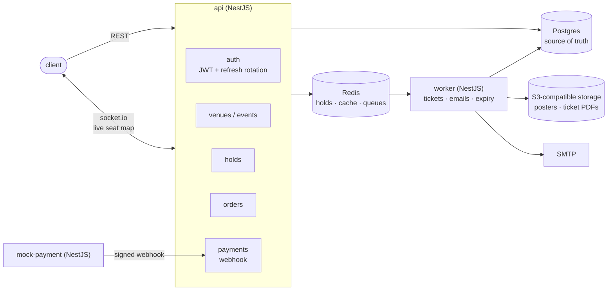
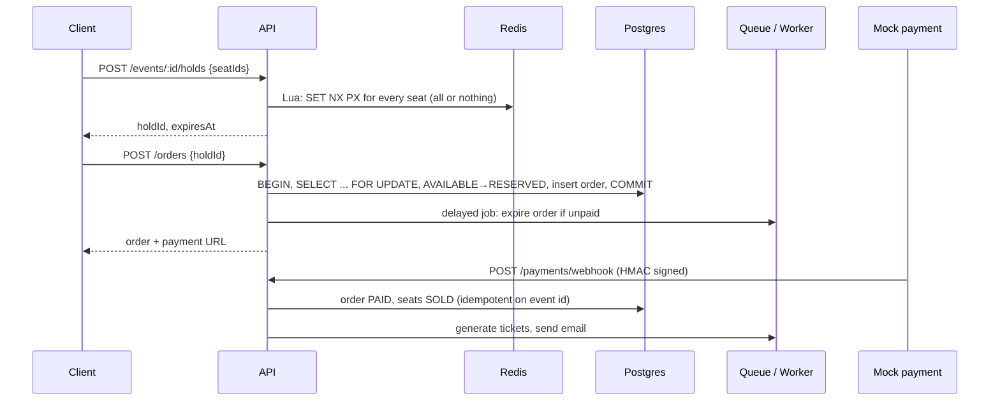

# event-ticketing

A ticketing and seat-reservation backend built with NestJS: venues with seat layouts, events with priced sections, seat holds, orders, payments via a signed webhook from a mock provider, PDF tickets with QR codes, check-in, and a live seat map over WebSockets.

The core problem it solves is the one every real ticketing system has: **the same seat must never be sold twice**, even when thousands of people click on it at the same moment. The answer is a two-layer reservation:

1. **Hold (Redis):** selecting seats takes a short-lived lock on each seat with `SET NX PX`, all-or-nothing across multiple seats via a Lua script. This absorbs the contention while users are still choosing, without touching the database.
2. **Checkout (Postgres):** turning a hold into an order locks the seat rows with `SELECT ... FOR UPDATE` inside a transaction and flips them from `AVAILABLE` to `RESERVED`. The database is the source of truth, so double-selling is impossible even if Redis loses data.

## Architecture



### Purchase flow



## Tech stack

| Area                 | Choice                                                   |
| -------------------- | -------------------------------------------------------- |
| Framework            | NestJS 12, TypeScript (`strict`), ESM                    |
| Database             | PostgreSQL + TypeORM (migrations only, no `synchronize`) |
| Cache, locks, queues | Redis, BullMQ                                            |
| Real time            | socket.io gateway with the Redis adapter                 |
| Tests                | Vitest, Supertest, Testcontainers                        |
| Lint / format        | oxlint, Prettier                                         |
| Package manager      | pnpm 12                                                  |

## Supply-chain security

Dependencies are treated as untrusted code. These protections are active:

- **No dependency install scripts.** pnpm blocks `preinstall`/`postinstall` scripts by default; any package that needs one must be listed explicitly in `allowBuilds`, and an unlisted one fails the install (`strictDepBuilds`).
- **`minimumReleaseAge: 4320`**: versions younger than 3 days are never installed. Malicious releases are usually caught and pulled within hours.
- **`trustPolicy: no-downgrade`**: if a package that used to be published with provenance suddenly ships a version without it (a sign of a stolen token), the install fails.
- **No exotic transitive sources**: sub-dependencies cannot come from git URLs or tarballs.
- **Lockfile committed**; Docker and CI install with `--frozen-lockfile`.
- **New dependencies are vetted** before being added (exact name, maintainers, install scripts, dependency count) and recorded in the table below with the reason they exist.

### Dependencies

| Package                                                      | Why                                                                                  |
| ------------------------------------------------------------ | ------------------------------------------------------------------------------------ |
| `@nestjs/common`, `@nestjs/core`, `@nestjs/platform-express` | The framework, on top of Express                                                     |
| `reflect-metadata`                                           | Runtime type metadata that Nest's dependency injection reads                         |
| `rxjs`                                                       | Nest's interceptors and streams are built on Observables                             |
| `@nestjs/config`                                             | Loads `.env`, exposes typed, namespaced config through DI                            |
| `zod`                                                        | Validates environment variables at startup and infers their types; zero dependencies |
| `typeorm`, `pg`                                              | ORM with first-class pessimistic locking (`FOR UPDATE`), and the Postgres driver     |
| `@nestjs/typeorm`                                            | Wires the TypeORM data source and repositories into Nest's DI                        |
| `class-validator`, `class-transformer`                       | Request DTO validation and type conversion for Nest's `ValidationPipe`               |

Development only: `@nestjs/cli`, `@nestjs/schematics`, `@nestjs/testing`, `typescript`, `vitest`, `@vitest/coverage-v8`, `vite-tsconfig-paths`, `supertest`, `oxlint`, `oxlint-tsgolint`, `prettier`, `source-map-support`, `@types/*`.

## Getting started

Requirements: Node.js 22+, pnpm 12, Docker.

```bash
cp .env.example .env    # then set DB_PASSWORD
docker compose up -d    # Postgres, Redis, Mailpit
pnpm install
pnpm start:dev          # http://localhost:3000, restarts on change
```

The app refuses to start if any environment variable is missing or invalid, and names the offending variable. If ports 5432 or 6379 are already taken on your machine, change `DB_PORT` / `REDIS_PORT` in `.env`; Docker Compose and the app read the same file.

| Service                 | Address                                  |
| ----------------------- | ---------------------------------------- |
| PostgreSQL              | `localhost:5432`                         |
| Redis                   | `localhost:6379`                         |
| Mailpit (SMTP / web UI) | `localhost:1025` / http://localhost:8025 |

All ports are bound to `127.0.0.1` only.

| Script            | What it does                |
| ----------------- | --------------------------- |
| `pnpm start:dev`  | Run with watch mode         |
| `pnpm build`      | Compile to `dist/`          |
| `pnpm start:prod` | Run the compiled build      |
| `pnpm test`       | Unit tests                  |
| `pnpm test:e2e`   | End-to-end tests            |
| `pnpm lint`       | Type-aware lint with oxlint |
| `pnpm format`     | Format with Prettier        |

## Project structure

```
src/
  main.ts               # bootstrap: creates the app from AppModule and listens
  app.module.ts         # root module; feature modules are registered here
  config/
    env.ts              # zod schema for every environment variable
    *.config.ts         # namespaced config (app, database, redis, mail) injected via registerAs
```
